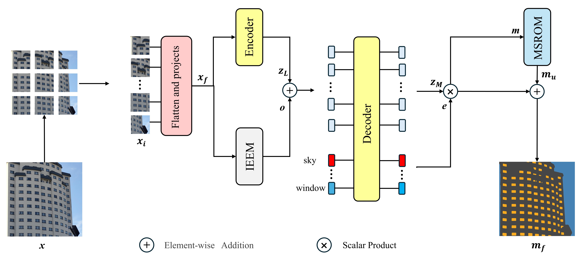

# GLNet for Accurate Facade parsing based on a new facade dataset
* Fan Wu,Junjie Cheng,Weijing Qin,Shuchang Xu

* Pytorch implementation of GLNet.

## Paper
GLNet for Accurate Facade parsing based on a new facade dataset


## Installation
Install Pytorch 2.0.1 and CUDA 11.7
Clone this repo
```
git clone https://github.com/OctAne0113/GLNet
cd GLNet
```
## HZNU FACADE DATASET
Download the dataset from here:
https://data.mendeley.com/datasets/k387xkyc5f/1

The "original" folder contains the original dataset, which includes facade images, annotated JSON files, and the homography matrices obtained through the perspective correction algorithm. 
The "perspective correction" folder contains the dataset after perspective correction, including the corrected facade images and the corresponding annotated JSON files, which represent sematic segmentation.
Facade images are named in increasing order, with those starting with "c" representing camera-captured facade images, and those starting with "d" representing drone-captured facade images.
Make sure that it follows the following data tree:

```
|-- original
|-- perspective correction
```


Using following command to complie our dataset
```
cd data/
python facade_data_generation.py --root [your_root]
```
## Perspective Correction
You can use the [Intersection_point.py ]()file to obtain the four intersections required for perspective transformation, and use [AngleTransfer.py]() to correct the angle of view of the original image

## "Training" GLNet
```
python train.py --model_name Segmenter --batch_size 4 --root [your_root]
```

## "Inference" GLNet
```
python inference.py --model_name Segmenter --eval_img [your_root]
```

## Contact
If you have any questions, please contact wufan@stu.hznu.edu.cn

## Citing
If you find the code useful for your research, please cite our paper.


